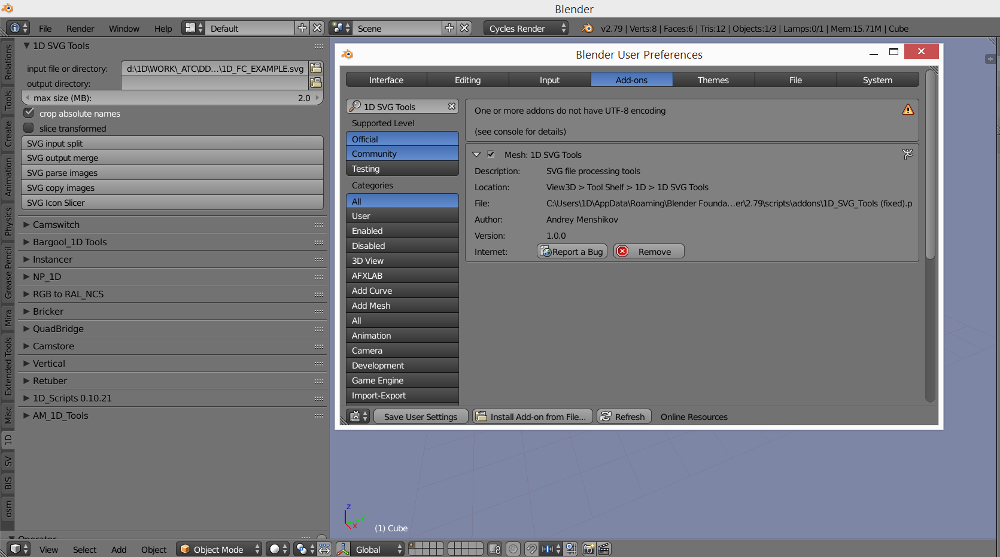
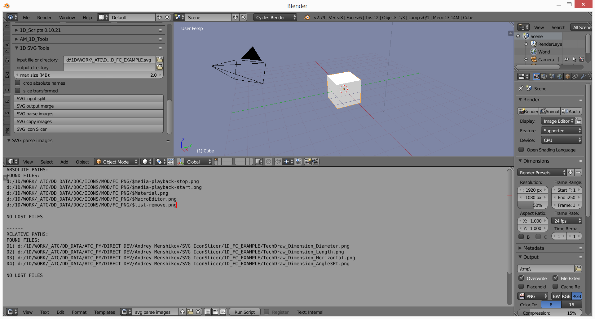
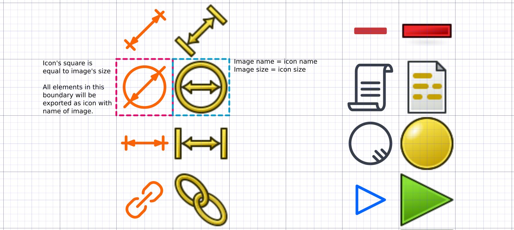

# COIL Icon Set description

COIL icon set is a result of research about redesign of FreeCAD icons in minimalistic style.
Main thread about COIL icon redesign
https://forum.freecadweb.org/viewtopic.php?f=34&t=34687
Icons are shared under CC-BY-SA 3.0 license,  license of code is GPL v2.

Archive contains FC_PNG folder with PNG images of all icons in different color variations, and three basic Incscape SVG files with all icons in file

- 1D_FC_COIL_LA_BASE.svg (Light theme A - 8 colors fullcolor theme)
- 1D_FC_COIL_LB_BLUE.svg (Light theme B - 5 colors blue theme)
- 1D_FC_COIL_DB_BLUE.svg (Dark theme B - 5 colors blue theme)

and three folders with correspond sliced result with icon per file, ready to be used in FreeCAD IconThemes addon.

- COIL_LA_v1.0
- COIL_LB_v1.0
- COIL_DB_v1.0

Instructions about how to install and use sliced icon themes in FreeCAD can be found on addon's page:
https://github.com/triplus/IconThemes

Base files can be edited in Inkscape https://inkscape.org/ , as it provides ability to select everything with the same color and recolor selection.
To slice modified base file into icon set we need to install 1D_ SVG_Tools addon in Blender 2.79 following further instructions, and use SVG icon slicer tool from it.

To get proper names of icons, all "$" signs have to be removed from icon names, for example, with Double Commaner.

# 1D_ SVG_Tools
is an addon for Blender 2.79, a toolkit that provides tools for SVG files.
It allows to split/merge given SVG files, find (parse)/copy images listed in it and slice specially prepared
files to multiple icons.

- INSTALLATION of 1D_SVG_Tools.py
    - Get Blender 2.79 from blender.org
    - Open program, open prefrences window (File – User Prefrences, or Ctrl+Alt+U shortcut).
    - In addons section press install addon from file button, specify 1D_SVG_Tools.py file,
       confirm, enable addon’s checkbox and press Save User Prefrences button.
    - Addon can be found in T-panel – 1D tab – 1D SVG Tools.

Addons instalation:

## SVG TOOLS

- SVG input split - splits svg file into pieces not exceeding selected size.
    - **Input** - SVG file of directory with SVG files to proceed.
    - **Output** - directory or empty for input directory.
    - **Max Size** - size for output files

- SVG output merge - merge files into one. Output file will be named MERGE.SVG
    - **Input** - directory with SVG files to proceed.
    - **Output** - directory or empty for input directory.

- SVG parse images
Scans SVG file for external image links and creates/rewrites Blneder interlnal text file called "svg
parse images.txt" with found paths.
    - **Input** - SVG file to scan.
    - **Crop Absolute Names** - Convert absolute paths into "input directory + file name". Result for absolute names will
be written into separated data block. Used for finding files near SVG (integrity check for archiving).

SVG Parse Images result:

- SVG copy images - Copy all files from external links found by SVG parse images into one
directory.
    - **Input** - svg file to scan
    - **Output** - directory or empty for input directory.

- SVG icon slicer (Slice Transformed checkbox = OFF) - slices single SVG file with icons into
multiple SVG icon files.
    - **Input** - file to slice
    - **Output** - directory or empty for input directory. In case of leaving empty files will be written in new directory
named "input file + output_name"

SVG Icon Slicer operation principle:

Icon filenames are taken from link of image objects from right side to the icon block.
Grids, Metadata and License data are copied from original SVG.
Objects with transformation matrices aren't supported properly, use Slice Transformed checkbox to
detect them. Text blocks are ignored.

- SVG icon slicer (Slice Transformed checkbox = ON) — an SVG analysis tool.
Creates temporal copy of SVG file, with all objects that have transformations moved to
"TranMatrix" layer, as they cause problems with SVG icon slicing. Used for detecting objects with
transformations and then fixing them in the original file.
    - **Input** - file to analyze
    - **Output** - directory or empty for input directory. In case of leaving empty name will be "input file + _out.svg"
